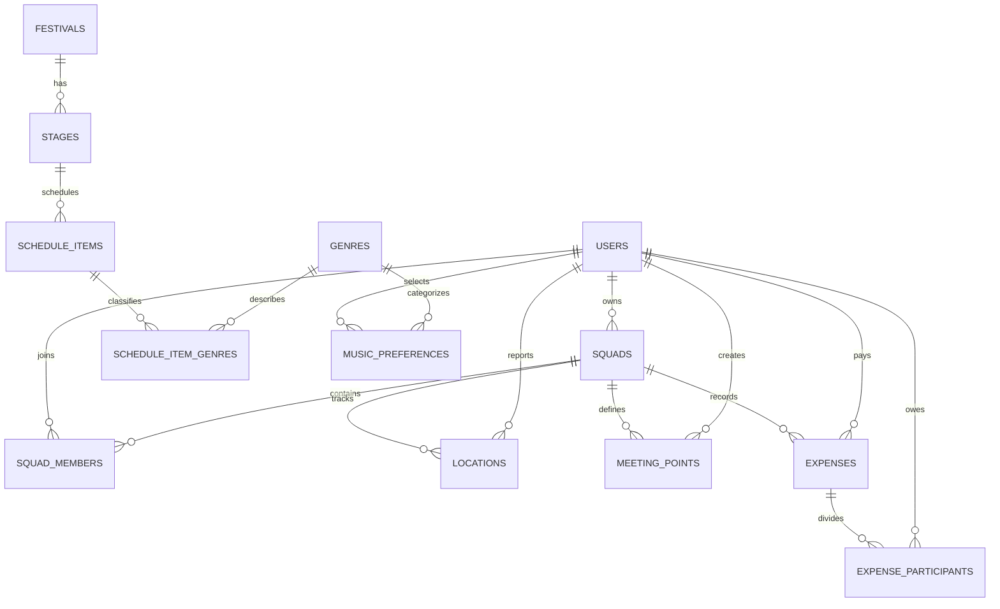

# Modelo de datos de FestiSquad

## Diagrama entidad-relación

## Validación de 3FN

- Cada tabla tiene una clave primaria estable y atributos atómicos.
- Los miembros y participantes usan tablas puente para relaciones muchos a muchos.
- Los géneros se almacenan en `genres`; no existen listas CSV dentro de una columna.
- `schedule_items` referencia al escenario. El festival se obtiene mediante
  `stages.festival_id`, evitando la dependencia transitiva
  `schedule_item -> stage -> festival` duplicada en la misma fila.
- Las preferencias musicales relacionan usuarios con géneros mediante claves, sin
  repetir el nombre textual del género.
- Los balances financieros se calculan en la vista `fund_balances`; no se guarda
  un saldo derivado que pudiera quedar desactualizado.
- Todos los importes usan `DECIMAL(18,2)`. `FLOAT` y `REAL` están prohibidos para
  dinero.

## Índices

Las restricciones únicas de `users.email` y `squads.code` generan índices únicos
en SQL Server. La migración de Fase 3 agrega índices para membresías por usuario,
ubicaciones recientes, gastos por squad, horarios, puntos de encuentro y
participantes de gastos.

Para una base creada durante la Fase 2 se debe ejecutar
`database/003_phase3_normalization_and_indexes.sql`. El script migra los géneros
existentes, elimina las dependencias redundantes y puede ejecutarse nuevamente sin
duplicar índices.
