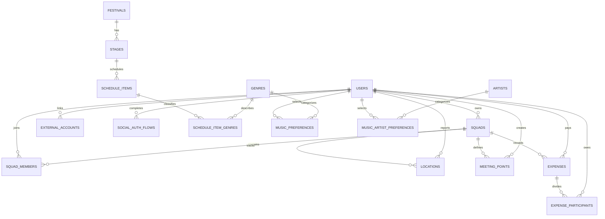

# Modelo de datos de FestiSquad

## Diagrama entidad-relación

```mermaid
erDiagram
    USERS ||--o{ SQUADS : owns
    USERS ||--o{ EXTERNAL_ACCOUNTS : links
    USERS ||--o{ SOCIAL_AUTH_FLOWS : completes
    USERS ||--o{ SQUAD_MEMBERS : joins
    SQUADS ||--o{ SQUAD_MEMBERS : contains
    FESTIVALS ||--o{ STAGES : has
    STAGES ||--o{ SCHEDULE_ITEMS : schedules
    SCHEDULE_ITEMS ||--o{ SCHEDULE_ITEM_GENRES : classifies
    GENRES ||--o{ SCHEDULE_ITEM_GENRES : describes
    USERS ||--o{ MUSIC_PREFERENCES : selects
    GENRES ||--o{ MUSIC_PREFERENCES : categorizes
    USERS ||--o{ MUSIC_ARTIST_PREFERENCES : selects
    ARTISTS ||--o{ MUSIC_ARTIST_PREFERENCES : categorizes
    SQUADS ||--o{ LOCATIONS : tracks
    USERS ||--o{ LOCATIONS : reports
    SQUADS ||--o{ MEETING_POINTS : defines
    USERS ||--o{ MEETING_POINTS : creates
    SQUADS ||--o{ EXPENSES : records
    USERS ||--o{ EXPENSES : pays
    EXPENSES ||--o{ EXPENSE_PARTICIPANTS : divides
    USERS ||--o{ EXPENSE_PARTICIPANTS : owes
```

## Validación de 3FN

- Cada tabla tiene una clave primaria estable y atributos atómicos.
- Los miembros y participantes usan tablas puente para relaciones muchos a muchos.
- Los géneros se almacenan en `genres`; no existen listas CSV dentro de una columna.
- `schedule_items` referencia al escenario. El festival se obtiene mediante
  `stages.festival_id`, evitando la dependencia transitiva
  `schedule_item -> stage -> festival` duplicada en la misma fila.
- `clash_votes` relaciona squad, horario y usuario; su clave compuesta evita
  votos duplicados sobre una opción.
- `clash_decisions` conserva una decisión por squad y empalme estable, junto al
  horario seleccionado y al administrador que la confirmó.
- Las preferencias musicales relacionan usuarios con géneros mediante claves, sin
  repetir el nombre textual del género.
- Los artistas favoritos están normalizados en `artists` y se relacionan con
  usuarios mediante `music_artist_preferences`, diferenciando origen manual y
  Spotify.
- Los balances financieros se calculan en la vista `fund_balances`; no se guarda
  un saldo derivado que pudiera quedar desactualizado.
- Cada gasto conserva un `client_request_id` único para que los reintentos de la
  cola offline sean idempotentes y no creen tickets duplicados.
- `external_accounts` separa la identidad de Google o Spotify del usuario local;
  la pareja proveedor/identificador externo y usuario/proveedor son únicas.
- `social_auth_flows` conserva solamente el hash del ticket temporal. Sus filas
  expiran y no almacenan credenciales ni tokens emitidos por terceros.
- `users.is_platform_admin` separa la administración global del catálogo de
  los roles internos de cada squad.
- `festivals` conserva recinto, ciudad, país, zona horaria, URLs editoriales y
  estado de publicación; sus escenarios mantienen la geometría GeoJSON.
- El archivado lógico de festivales preserva agendas y referencias históricas.
- Todos los importes usan `DECIMAL(18,2)`. `FLOAT` y `REAL` están prohibidos para
  dinero.

## Índices

Las restricciones únicas de `users.email` y `squads.code` generan índices únicos
en SQL Server. La migración de Fase 3 agrega índices para membresías por usuario,
ubicaciones recientes, gastos por squad, horarios, puntos de encuentro y
participantes de gastos.

Para una base creada durante la Fase 2 se deben ejecutar, en orden,
`database/003_phase3_normalization_and_indexes.sql` y
`database/004_phase5_expense_idempotency.sql`. Después se aplica
`database/005_phase6_music_preferences.sql` para artistas y preferencias. Estos
scripts normalizan los datos y agregan índices sin recrear la base. Finalmente,
`database/007_phase8_social_auth.sql` agrega identidades externas y flujos OAuth
de un solo uso. `database/008_phase10_festival_catalog.sql` añade la
administración global, la geometría y los metadatos indexados del catálogo.
`database/009_phase11_settlements.sql` incorpora las liquidaciones entre
miembros y las integra en la vista de saldos.
